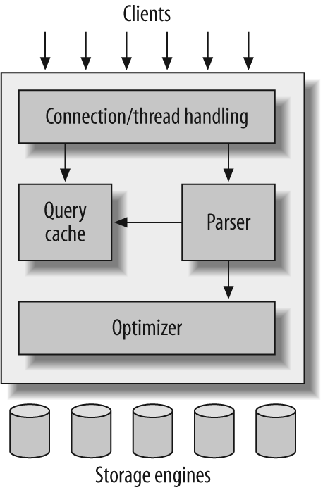

# Mysql

## Logical Architecture



The topmost layer contains the services that aren’t unique to MySQL. They’re services most network-based client/server tools or servers need: connection handling, authentication, security, and so forth.

The second layer includes the code for query parsing, analysis, optimization, caching, and all the built-in functions \(e.g., dates, times, math, and encryption\). Any functionality provided across storage engines lives at this level: stored procedures, triggers, and views, for example.

The third layer contains the storage engines. They are responsible for storing and retrieving all data stored “in” MySQL.The server communicates with them through the _storage engine API_. This interface hides differences between storage engines and makes them largely transparent at the query layer. The API contains a couple of dozen low-level functions that perform operations such as “begin a transaction” or “fetch the row that has this primary key.” The storage engines don’t parse SQL or communicate with each other; they simply respond to requests from the server.

### Clustered Index

Typically, an [index](https://www.mysqltutorial.org/mysql-index/) is a separate data structure such as B-Tree that stores the key values used for faster lookups.

A clustered index, on the other hand, is actually the **table**. It is an index that enforces the ordering on the rows of the table physically.

Once a clustered index is created, all rows in the table will be stored according to the key columns used to create the clustered index.

Because a clustered index store the rows in sorted order, each table have only one clustered index.

Each InnoDB table requires a clustered index. The clustered index helps an InnoDB table optimize data manipulations such as [`SELECT`](https://www.mysqltutorial.org/mysql-select-statement-query-data.aspx), [`INSERT`](https://www.mysqltutorial.org/mysql-insert-statement.aspx), [`UPDATE`](https://www.mysqltutorial.org/mysql-update-data.aspx) and [`DELETE`](https://www.mysqltutorial.org/mysql-delete-statement.aspx).

When you define a [primary key](https://www.mysqltutorial.org/mysql-primary-key/) for an InnoDB table, MySQL uses the primary key as the clustered index.

If you do not have a primary key for a table, MySQL will search for the first [`UNIQUE`](https://www.mysqltutorial.org/mysql-unique/) index where all the key columns are [`NOT NULL`](https://www.mysqltutorial.org/mysql-not-null-constraint/) and use this `UNIQUE` index as the clustered index.

In case the InnoDB table has no primary key or suitable `UNIQUE` index, MySQL internally generates a hidden clustered index named `GEN_CLUST_INDEX` on a synthetic column which contains the row ID values.

As the result, each InnoDB table always has one and only one clustered index.

All indexes other than the clustered index are the non-clustered indexes or secondary indexes. In InnoDB tales, each record in the secondary index contains the primary key columns for the row as well as the columns specified in the non-clustered index. MySQL uses this primary key value for the row lookups in the clustered index.

Therefore, it is advantageous to have a short primary key otherwise the secondary indexes will use more space. Typically, the [auto-increment](https://www.mysqltutorial.org/mysql-sequence/) integer column is used for the primary key column.

### Prefix Index

When you create a secondary index for a column, MySQL stores the values of the columns in a separate data structure e.g., B-Tree and Hash.

In case the columns are the string columns, the index will consume a lot of disk space and potentially slow down the [`INSERT`](https://www.mysqltutorial.org/mysql-insert-statement.aspx) operations.

To address this issue, MySQL allows you to create an index for the leading part of the column values of the string columns using the following syntax:

```text
column_name(length)
```

### Unique Index

To enforce the uniqueness value of one or more columns, you often use the [`PRIMARY KEY`](https://www.mysqltutorial.org/mysql-primary-key/) constraint. However, each table can have only one primary key. Hence, if you want to have a more than one column or a set of columns with unique values, you cannot use the primary key constraint.

Luckily, MySQL provides another kind of [index](https://www.mysqltutorial.org/mysql-index/mysql-create-index/) called `UNIQUE` index that allows you to enforce the uniqueness of values in one or more columns. Unlike the `PRIMARY KEY` index, you can have more than one `UNIQUE` index per table.

To create a `UNIQUE` index, you use the `CREATE UNIQUE INDEX` statement as follows:

```text
CREATE UNIQUE INDEX index_name
ON table_name(index_column_1,index_column_2,...);
```

### Composite Index

A composite index is an index on multiple columns. MySQL allows you to create a composite index that consists of up to 16 columns.

A composite index is also known as a multiple-column index.

The query optimizer uses the composite indexes for queries that test all columns in the index, or queries that test the first columns, the first two columns, and so on.

If you specify the columns in the right order in the index definition, a single composite index can speed up these kinds of queries on the same table.

### Index Cardinality

Index cardinality refers to the uniqueness of values stored in a specified column within an index.

MySQL generates the index cardinality based on statistics stored as integers, therefore, the value may not be necessarily exact.

The query optimizer uses the index cardinality to generate an optimal query plan for a given query. It also uses the index cardinality to decide whether to use the index or not in the [join](https://www.mysqltutorial.org/mysql-join/) operations.

If the query optimizer chooses the index with a low cardinality, it is may be more effective than scan rows without using the index.

### USE INDEX hint

In MySQL, when you submit an SQL query, the query optimizer will try to make an optimal query execution plan.

To determine the best possible plan, the query optimizer makes use of many parameters. One of the most important parameters for choosing which index to use is stored key distribution which is also known as cardinality.

The cardinality, however, may be not accurate for example in case the table has been modified heavily with many inserts or deletes.

To solve this issue, you should run the `ANALYZE TABLE` statement periodically to update the cardinality.

In addition, MySQL provides an alternative way that allows you to recommend the indexes that the query optimizer should by using an index hint called `USE INDEX`.

Notice that when you recommend the indexes to use, the query optimizer may either decide to use them or not depending on the query plan that it comes up with.

### FORCE INDEX

The query optimizer is a component in the MySQL Database server that makes the most optimal execution plan for an SQL statement.

The query optimizer uses the available statistics to come up with the plan that has the lowest cost among all candidate plans.

For example, a query might request for products whose prices are between 10 and 80. If the statistics show that 80% of products have these price ranges, then it may decide that a full table scan is the most efficient. However, if statistics show that very few products have these price ranges, then reading an index followed by a table access could be faster and more efficient than a full table scan.

In case the query optimizer ignores the index, you can use the `FORCE INDEX` hint to instruct it to use the index instead.

