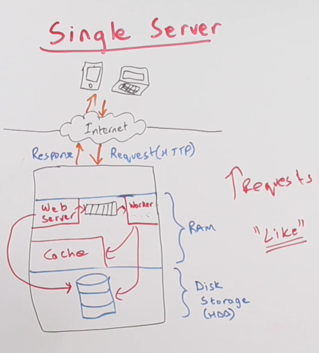

# Anatomy of System Design Interview

## Scalable Web Applications

* Started by speculating features
  * things that this application can do or should include
  * use cases
  * functional and non-functional requirements
* High-level design
  * started with a diagram with very basic components
    * single server
    * multiple servers
    * * walk through the use cases

