# Chatting App

## Scenario

### Functional Requirements

* One-to-one messaging
* Group messaging
* Online/offline status
* History \(optional\)
* Login/Logout \(optional\)
* Contacts \(optional\)
* Multi-Devices \(optional\)

### Non-Functional Requirements

* Highly available
* Real-time messaging experience with minimum latency
* Highly consistent

### Capacity Estimation and Constraints

* FB official data
  * Total 1B active users
  * 75% DAU/MAU
  * ~750M DAU
* Assume 100M DAU
* QPS
  * 20 messages daily per-user
  * average QPS = 100M \* 20 / 86400 ~= 20k
  * Peak QPS = 20k \* 5 = 100k
* Storage
  * 20 messages \* 100M = 2B messages
  * 30 bytes for each message = 30 \* 2B = 6GB

## Service

* Messaging Service
* Real-time, Delivery Service

## Storage

* P2P chatting
  * Two users must be online at the same time
  * Cannot record chat history
  * The message goes not go through server
* Message Table

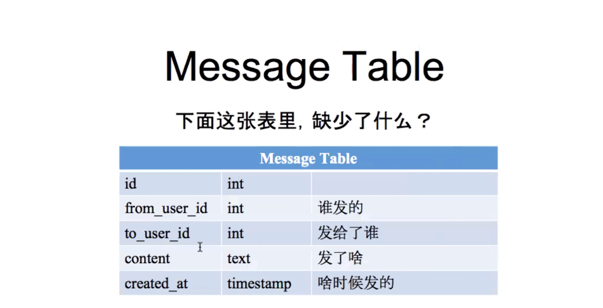

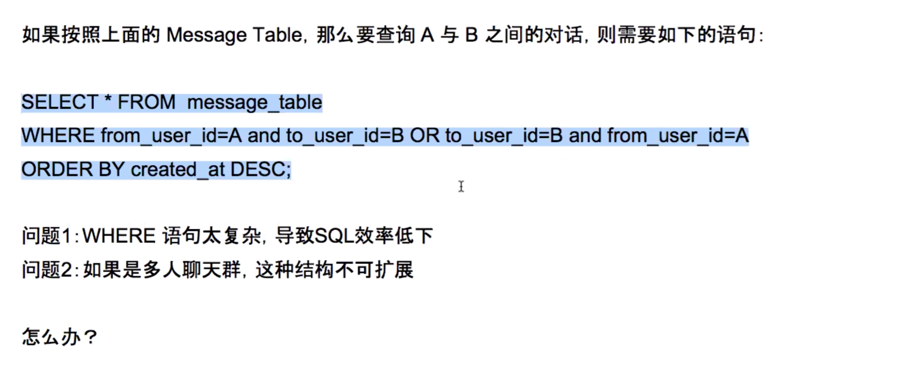

### Solution

#### Thread Table

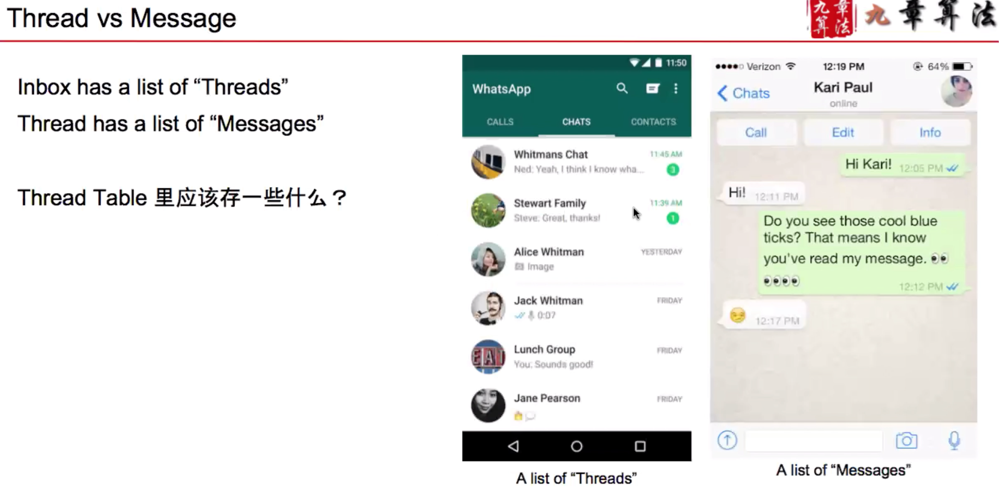

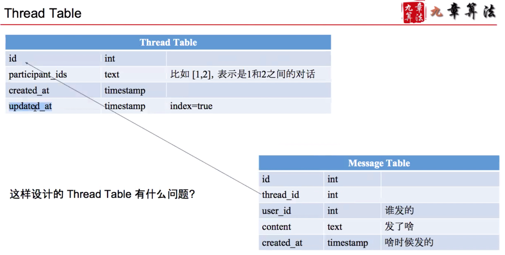

#### Issues

* Some of the attributes for thread is private
  * is\_muted
  * nickname
  * unread messages

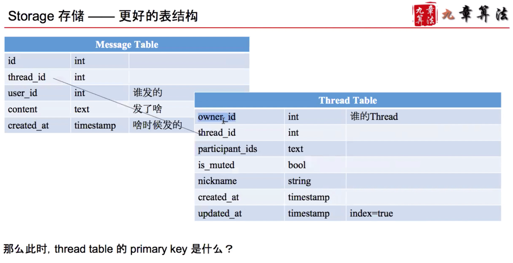

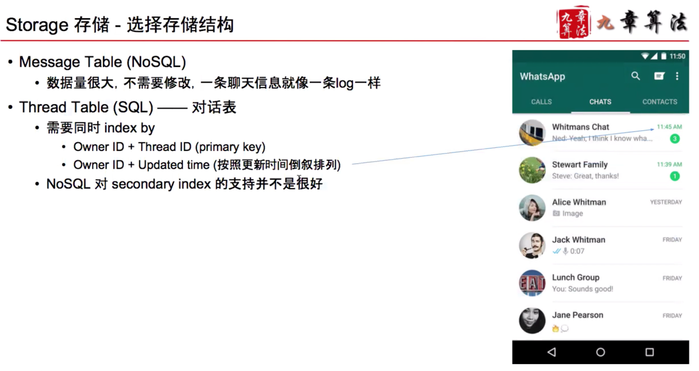

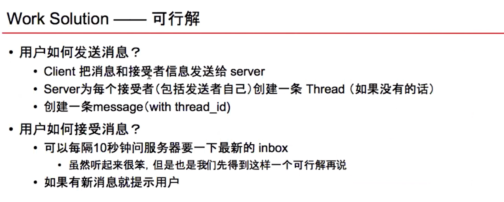

## Scale

### How to scale out

Message Table shard thread\_id, all messages with the same thread\_id will be sharded to the same machine.

Thread table shard owner\_id, all messages with the same message\_id will be sharded to the same machine.

### How to speed up

Query server every few seconds is not efficient

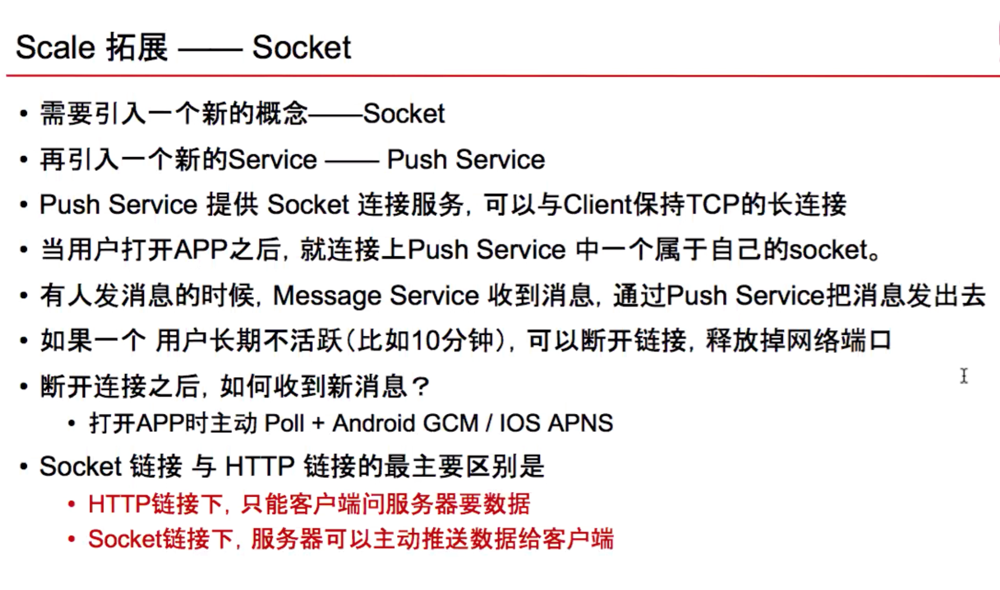

### Pull vs Poll

#### Pull

Client sends request to write/read data.

#### Poll

Client periodically sends requests to server to write/read data.

### Flow

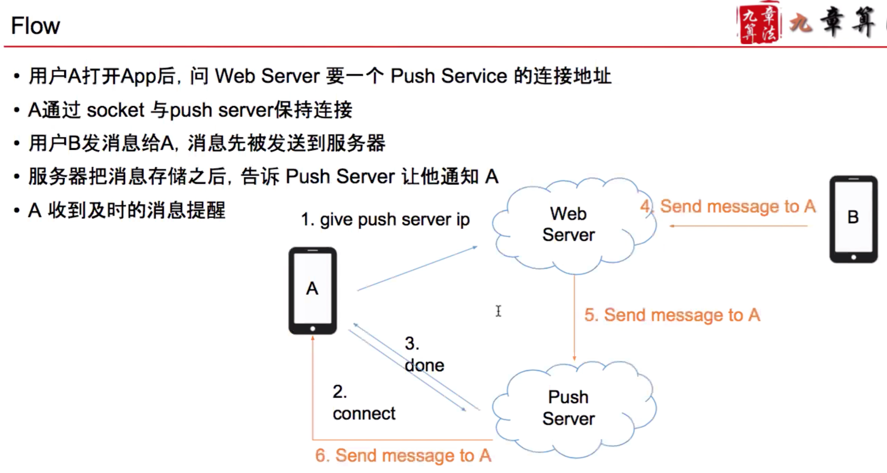

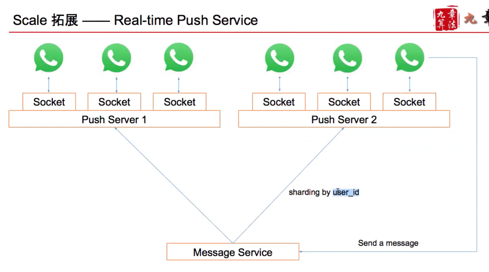

### How to support group chat

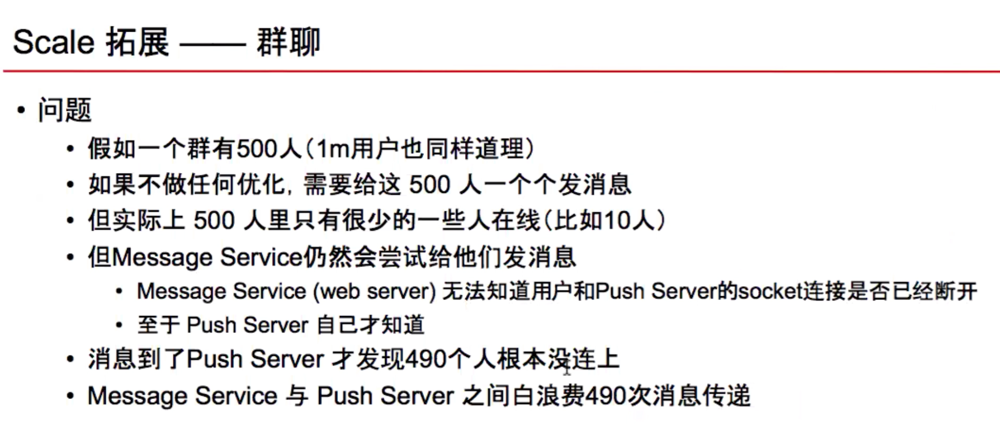

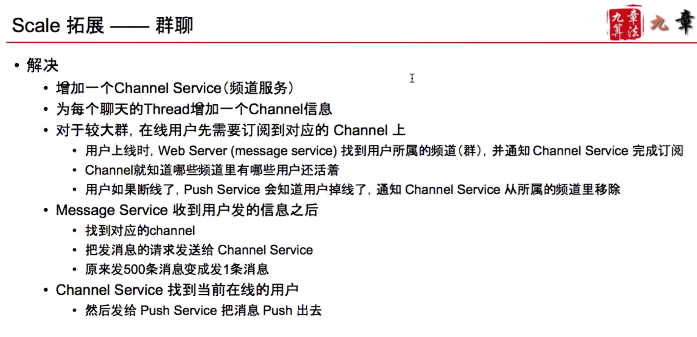

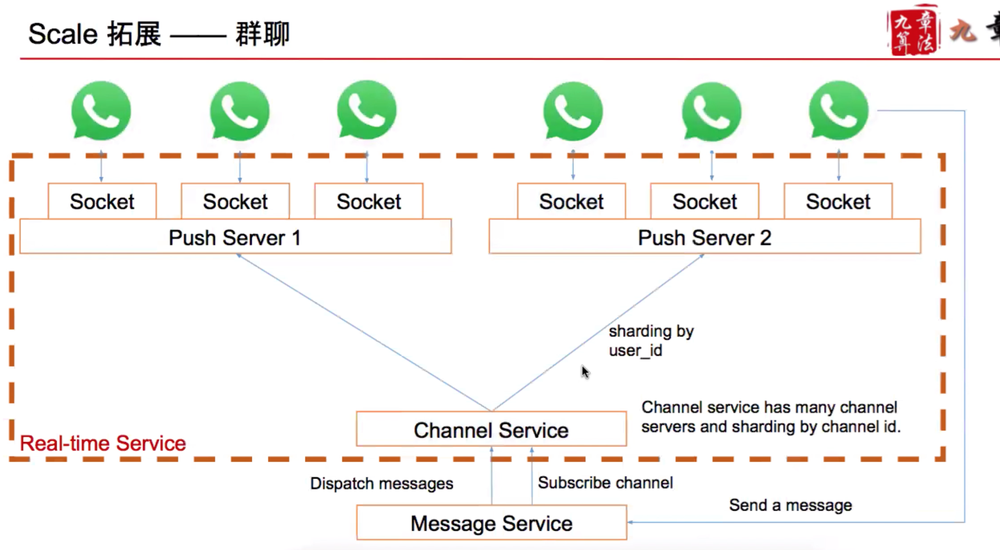

