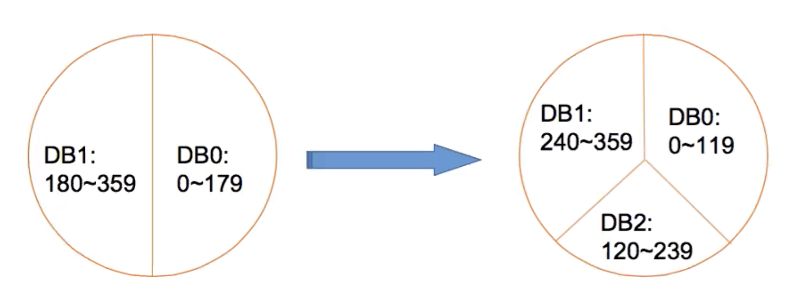

# Consistent Hashing & Design Tiny URL

## Single Point Failure

### Sharding -&gt; Partition

* Partition data into different parts based on certain rules, and saving those parts to different machines
* Even if one point gets down, it is not going to lead the entire system to be down
* Replica -&gt; Duplicate
  * Duplicate data into many copies \(usually three copies\)
  * Amortize read requests


SQL Databases do not have built-in sharding, NoSQL databases usually have built-in sharding.



Usually NoSQL database use key-value to query whereas SQL based database usually use relational, structural language to query.


#### Vertical Sharding

* One table for one database
* or partition a table based on each column into two or more tables
  * User table
    * email id, user id,  password rarely change -&gt; User table
    * avatar, status\_text often change -&gt; User profile
* Disadvantages
  * if the table is really big

#### Horizontal Sharding

* Simple idea is to use the id to mod number of machines
  * Problem
    * What if add new machines, then many data need to be moved
      * Slow, write
      * server gets heavy load
      * data inconsistency

## Consistent Hashing

For solving single point failure.

### Inconsistent hashing

* % n is the easiest way to do hashing
* but when n turns into n + 1, every key % n and key % \(n + 1\) gets different results
* therefore, this way is called inconsistent hashing
* the problem with this solution is that when adding a new server, many keys have been hashed to a different value, therefore it needs to move many data

### A simple consistent hasing

* use key to mod a very large number, like 360
* distribute 360 to n machines, each machine in charge of a certain interval
* a table stores information about how 360 is being distributed is stored in a web server
* when adding a new machine, insert randomly at a position in the table, take some throughputs from adjacent two servers
* if adding a machine like n from 2 - 3, only 1/3 of the data needs to be moved
* disadvantages:
  * data is distributed unevenly
  * data migration overloaded for old machines since new machine only is going to load data from those two machines

## Consisten Hashing

