# Crawlers, Typeahead

## Design a Web Crawler \(Google\)

Google uses web crawlers to implement its search engine. Since each site is possibly updating everyday, google crawls those sites not only one time, but many times periodically. Usually the purpose of web crawler is to fetch the content of web pages to process, extract and analyze

### Scenario

* How many pages
  * crawl **1.6m web pages per second** \(1,000,000,000,000 / 7 / 86400 \)
    * 1 trilion web pages
* How often \(crawling frequency\)
  * crawl all of them **every week**
* How large \(space\)
  * 10p \(petabyte\) web page storage \(Distributed System\)
    * average of a web page 10k

### A simplistic news crawler

* given the url of news list page
  * Send an http request to get the content of the news list page
    * use lib to get the content of the web page
  * Extract all the news titles from the news list page
    * use regular expression to match title content

### Crawling Algorithm

* BFS

### A Single-Threaded Web Crawler

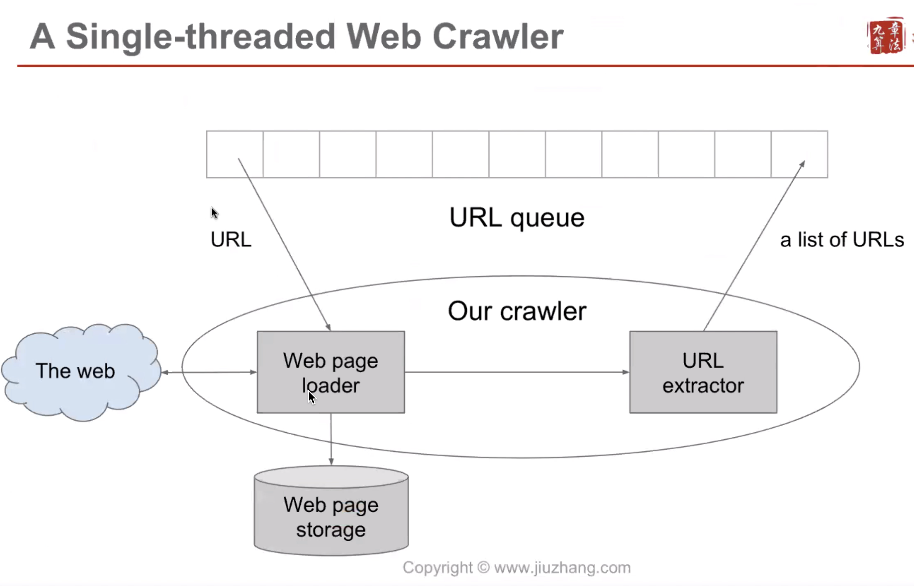

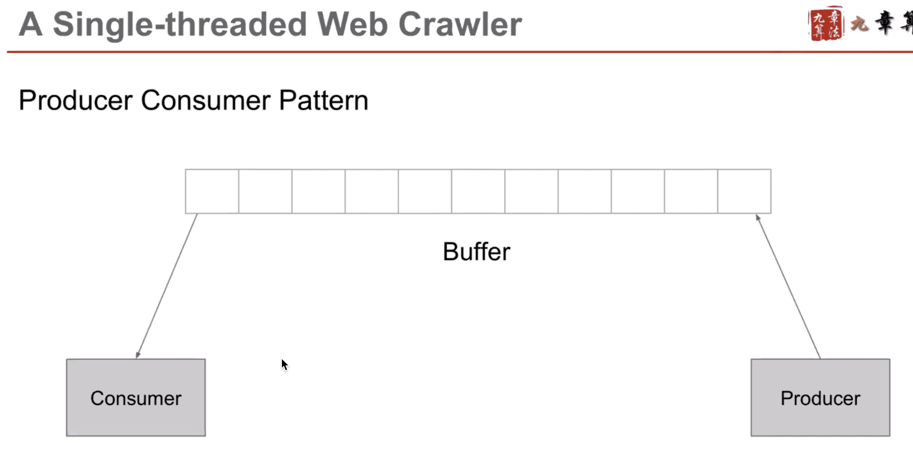


To implement a producer and consumer pattern, you'll need to create two threads for each role \(consumers and producers\). Set the speed of each thread to process differently.


### A Multi-threaded Web Crawler

* multi-threaded model share the same crawling queue

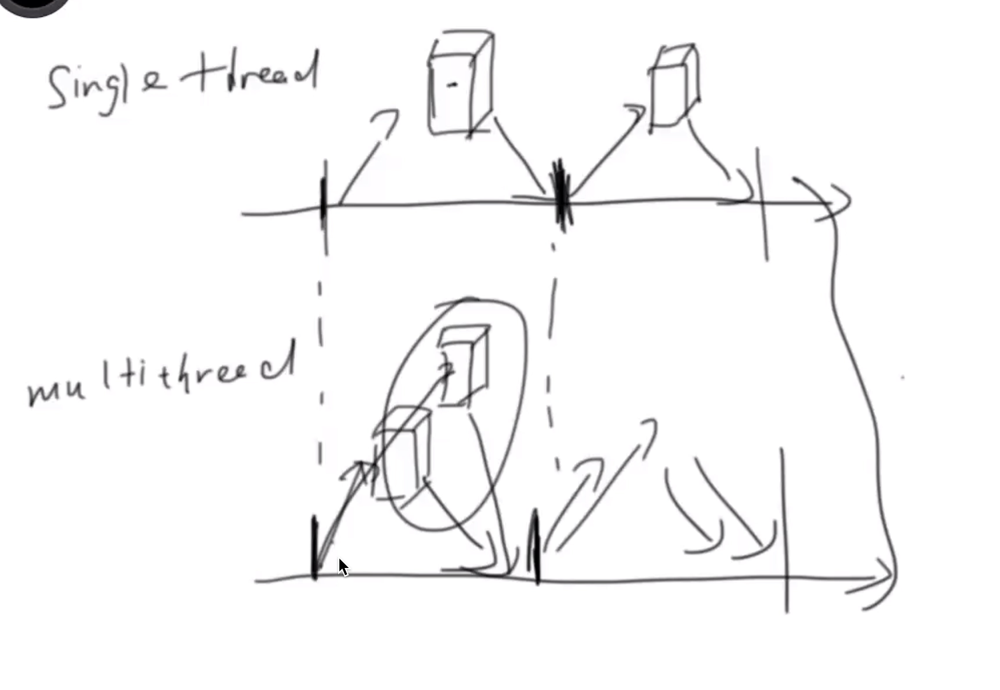

### How different threads work together

* Three approaches
  * sleep
  * condition variable 
    * Try to lock and consume the resource once it's been released
  * semaphore \(信号量， 是一个整数\)
    * Allow multiple consumers to lock resource


However, more threads do not necessarily mean more performance

Why?

* Context switch cost \(Single core CPU\)
* Number of Thread \(port\) limitations
* Network bottleneck for single machine


### A distributed Web Crawler

#### Problem with Task Queue

* Queue is a data structure stored in memory but we may have tons of tasks
* Once the url has been pushed to queue, the order is fixed, but often the cases we crawl each url with different orders and frequency

#### Design task table

* Usually a task table contains tasks that each represents a url to crawl
  * each task may contain a url, state, priority and available time

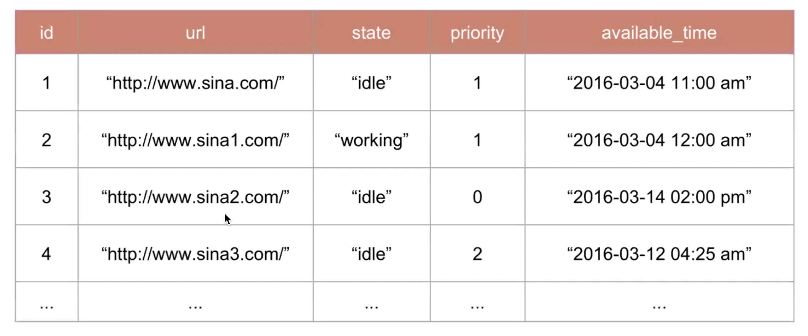


The way to see if the content crawled from a url is different from last time it's crawled is to **hash the web content** to get a hash value, with the hash value we can compare it with last value

Let's say initial time interval for crawling all webpages is one week, then we would adjust it's interval based on how often a site is being updated, and only crawl those pages with available time less or equal than now, but not future available time.


* Get 1000 tasks per request from task table
  * once a task is being processing by a crawler machine, it will be marked as working \(繁忙\) to represent current status, and will not be processed again by crawlers. Other tasks with status 'idle' can be distributed by task table and processed by crawlers

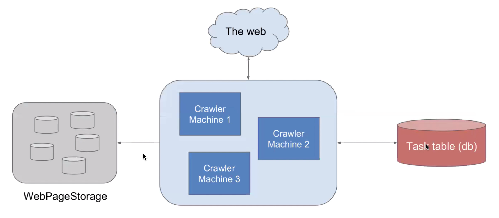

#### Problems for this basic architecture

* Table could be super big

#### Task table sharding

#### How to handle update for failure

Exponential Back-off

If we get 404 page from a website, then:

success: crawl after one week

No.1 failure: crawl after 2 weeks \(everytime we double the time\)

No.2 failure: crawl after 4 weeks

No.3 failure: crawl after 8 weeks

* Content Update
* Crawling failure

#### Solution

Content Update

* Exponential back-off. Basically for the first time, if it was successfully to crawl a website and after one week, the webpage does no change at all, then the crawling frequency would be changed to crawl after 2 week, so it works like
  * No update for 1 week -&gt; crawl after 2 weeks
  * No update for 2 week -&gt; crawl after 4 weeks
  * No update for 4 week -&gt; crawl after 8 weeks
  * ...........
* The same mechanism works the same but in reverse when it comes to websites which are frequently updating

Crawling failure

#### Use quota

In all those urls, there may be many urls that belong to one single domain \(websites\), we do not want all resources are spent on that single domain just because there are more urls to crawl compared to others.

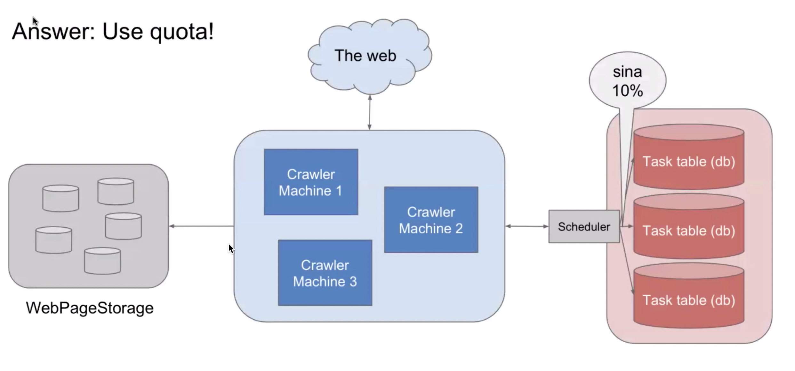

#### multi-region

Use servers close to the host of the website

## Summary

### senario

* How many pages
  * crawl **1.6m web pages per second** \(1,000,000,000,000 / 7 / 86400 \)
    * 1 trilion web pages
* How often \(crawling frequency\)
  * crawl all of them **every week**
* How large \(space\)
  * 10p \(petabyte\) web page storage \(Distributed System\)
    * average of a web page 10k

### Service

* Crawler
* Task service
* Storage service

### Storage

* Use database to store tasks
* BigTable to store webpages

### Scale

* Single -&gt; multi -&gt; distributed
* queue -&gt; table
* db sharding
* content update/crawling failure handling
* Avoid dead cycle, use quota
* multi-region

## How to design a Typeahead

Type ahead of you, searching suggestions

### Scenario

* Given a prefix -&gt; get top n search keywords
* DAU \(daily active user\): 500M
* Search: 4 \* 6 \* 500M = 12B \(every user searches 6 times, types 4 letters\)
* QPS = 12B / 86400 ~= 138k
* Peak QPS = QPS \* 2 ~= 276k

### Service

We noticed that the QPS is really high for this system.

* Query Service
* Data Collection Service
  * collecting, sorting, processing and storing keywords that user searched
  * Updating on a daily/weekly/any reasonable frequency
    * Summarize searched keywords for the past day/week/any reasonable frequency

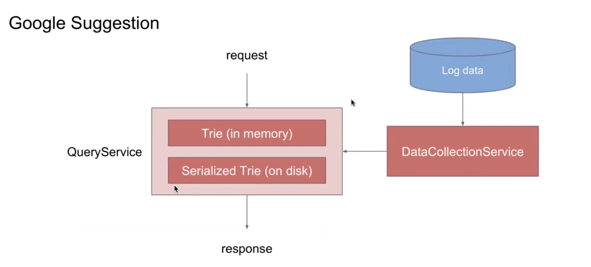

### Storage

#### Query Service

* what kinds of data
* do we need to store
* the naive way

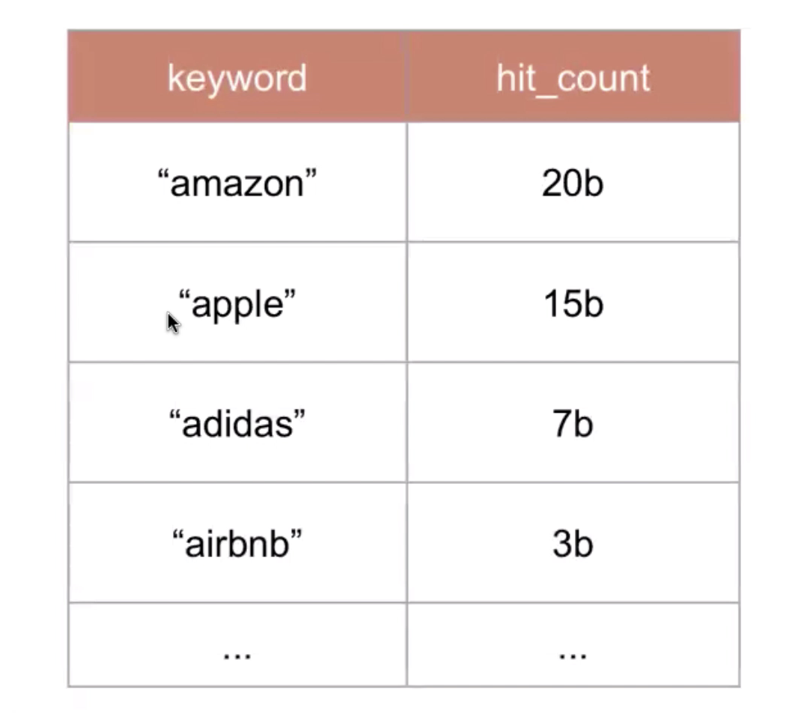

Above table is the table we collect hit-count every day, and this table is going to be transformed into a trie data structure

#### how to query the database

* query payload {key}
* query sql
  * select \* from hit\_stats where keyword like \`${key}%\` order by hit\_count DESC limit 10
    * this is time consuming
* therefore we need a prefix table

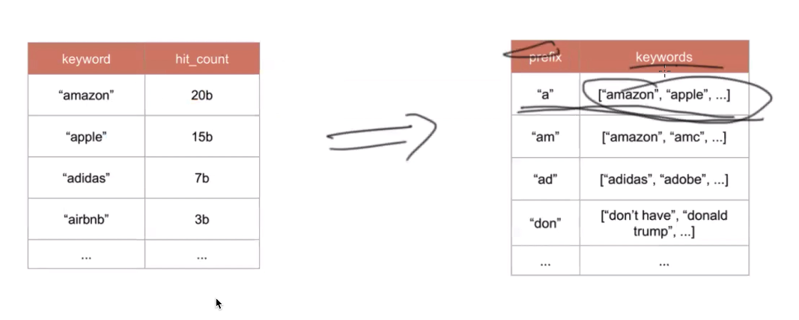

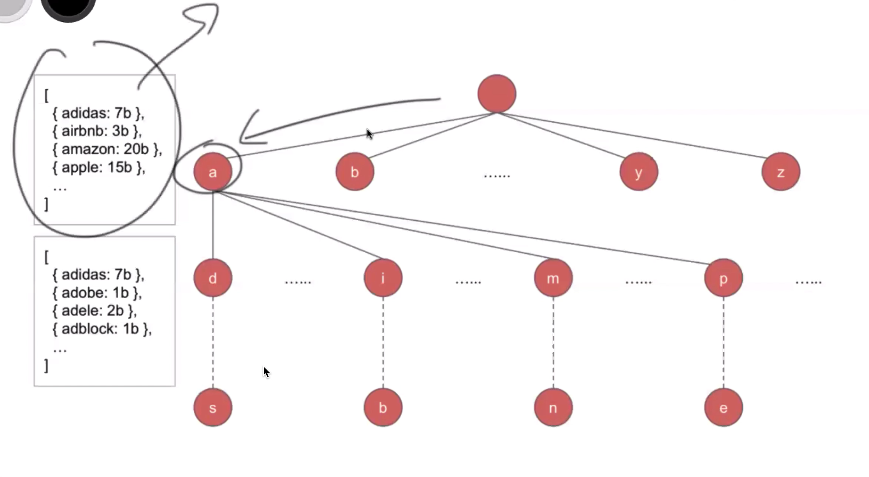

### Where does raw data come from

* Essentially asking, what does DataCollectionService do

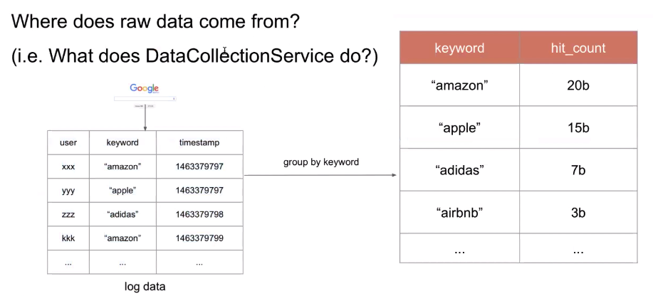

When traffic going to query-service machine, the trie in it will be locked for query. The DataCollectionService would not update trie lively.

### How to qualify this system

* Key metric: response time
  * use cache \(browser cache\) in the front end to reduce response time
* Bottom line: result quality

### When trie gets to large for one machine

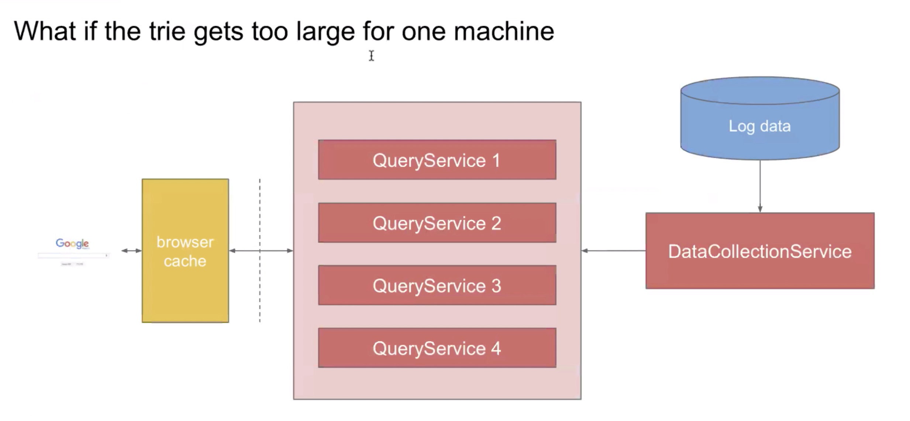

#### Store trie across multiple machines

* Use consistent hashing to decide which machine a particular string belongs to
  * it works like getting the hash value for a prefix and use that value as the id of a machine, and store information about the prefix on that machine

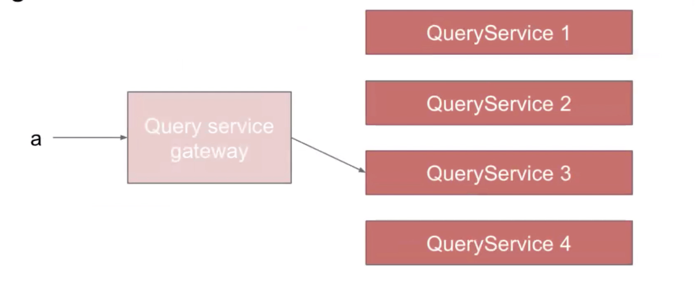

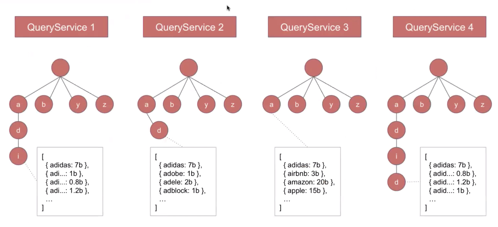

### How to reduce log file

* For prefixes that have relatively higher searching volumes, we pick a random number each time and only when it is a certain number then we log it.
  * like amazon, say if we have 20b each day, then every time we pick a random number from 1 - 1000 and only log it when we get number 1

