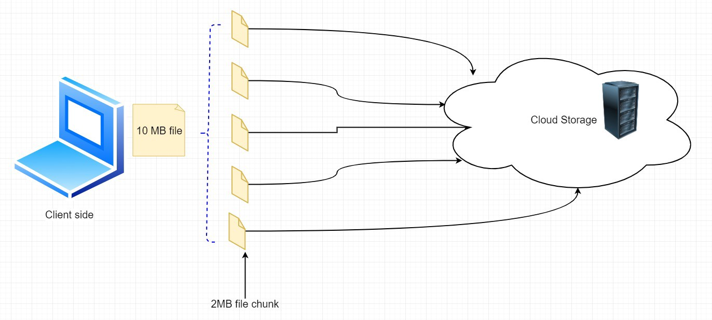
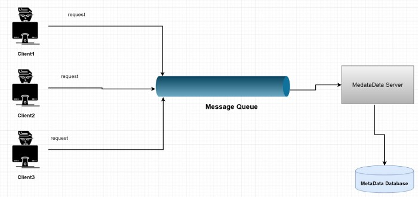
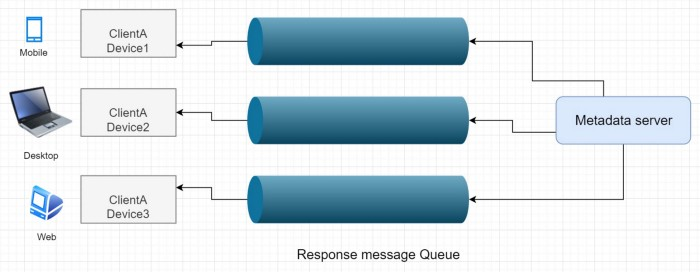
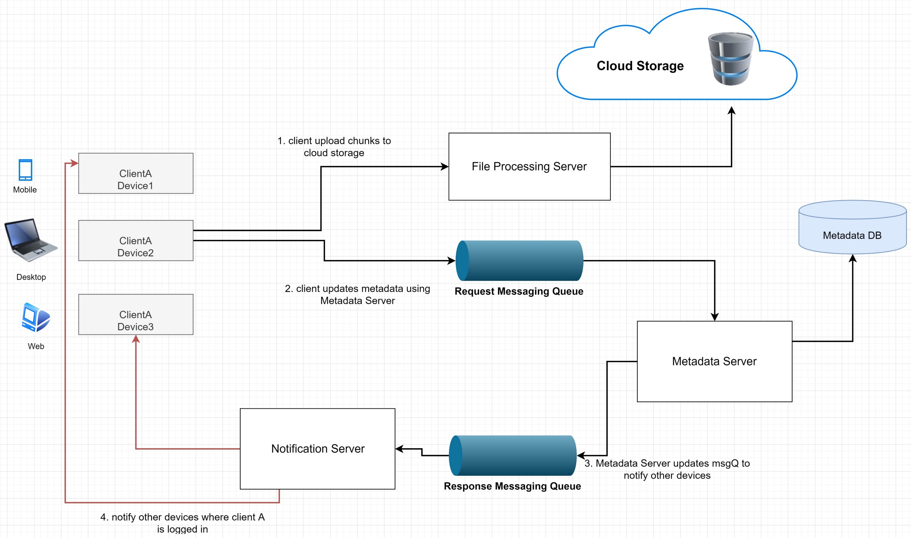
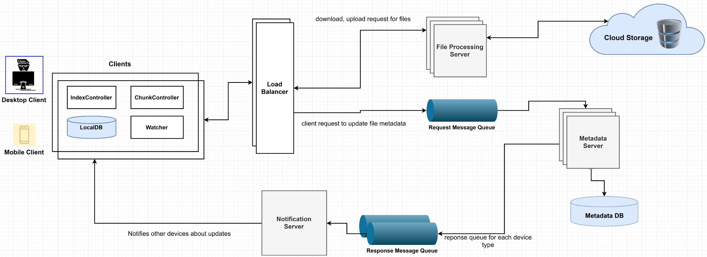

# Google Drive

## Requirements

### Functional

* Upload, download, update, delete files from any device
* File syncronized throughout all devices

### Non-functional

* Highly available
* Support high volume of traffic

## Server-side Component Design

### Handle file transfer efficiently 

We may divide each file into smaller chunks. Then we can modify only small pieces where data is changed, not the whole file. In case data upload failure also this strategy will help. We need to divide each file into a fixed size, say 2 MB.

Our chunk size needs to be smaller. It will help to optimize space utilization, and network bandwidth is another considering factor while making the decision. Metadata should include the record of each file’s chunk information.

As we have this article for practice, so we may assume that files need to be stored in small chunks of 2 MB. We will get benefits in case of retry operation also _**for smaller pieces of a file**_ if a process is failed. _****If a file is not uploaded, then only the failing chunk will be retried._

Less amount of data transfer between clients and cloud storage will help us achieve a better response time. Instead of transmitting the entire file, we can send only the modified chunks of the files.

### What will happen when the client is offline? 

 A client component, Watcher, will observe client-side folders. If any change occurs by the user, it will notify the Index Controller\(another client component\) about the action of the user. It will also monitor if any change is happening on other clients\(devices\), which are broadcasted by the Notification server.

### Metadata Database: 

We need a database that is responsible for keeping information about files, users, etc. It can be a relational database like MySQL or NoSQL like MongoDB. We need to save data like chunks, files, user information, etc. in the Database.

As we all know, we have to choose between two types of Database, SQL or NoSQL. Whatever we choose, we need to ensure data consistency.  
_Using a SQL database may give us the benefit of the implementation of the synchronization as they support ACID properties._

_NoSQL databases do not support ACID properties. But they provide support for scalability and performance. So, we need to provide support for ACID properties programmatically in the logic of our Metadata server for this type of Database._

### Synchronization: 

Now the client updates a file from a device; there needs to be a component that processes updates and applies the change to other devices. It needs to sync the client’s local Database and remote Metadata DB. MetaData server can perform the job to manage metadata and synchronize the user’s files.

### Message Queue: 

Now think about it; such a huge amount of users are uploading files simultaneously, how the server can handle such a large number of requests. To be able to handle such a huge amount of requests, we may use a message queue between client and server.

The message queue provides temporary message storage when the destination program is busy or not connected. It provides an **asynchronous communications protocol.** It ****is a system that puts a message onto a queue and does not require an immediate response to continue processing. RabbitMQ, Apache Kafka, etc. are some of the examples of the messaging queue.

In case of a message queue, messages will be deleted from the queue once received by a client. So, we need to create several Response Queues for each subscribed device of the client.

### Cloud Storage: 

_Nowadays, there are many platforms and operating systems like smartphones, laptops, personal computers, etc. They provide mobile access from any place at any time._

_If you keep files in the local storage of your laptop and you are going out but want to use it on your mobile phone, how can you get the data? That’s why we need cloud storage as a solution._

It stores files\(chunks\) uploaded by the users. Clients can interact with the storage through **File Processing Server** to send and receive objects from it. It holds only the files; Metadata DB keeps the data of the chunk size and numbers of a file.

### File processing Workflow: 

Client A uploads chunk to cloud storage. Client A updates metadata and commits changes in MetadataDB using the Metadata server. The client gets confirmation, and notifications are sent to other devices of the same user. Other devices receive metadata changes and download updated chunks from cloud storage.

## ★Scalability

We need to partition the metadata database so that we can store information about 1 million users and billions of files/chunks. We can partition data to distribute the read-write request on servers.

### MetaData Partitioning: 

_**i\)**_ We can store file-chunks in partitions based on the first letter of the File Path. For example, we keep all the files starting with the letter ‘A’ in one partition and those beginning with the letter ‘B’ into another partition and so on. _This is called range-based partitioning_. Less frequently occurring letters like ‘Z’ or ‘Y,’ we can combine them into one partition.

_The main problem is that some letters are common in case of a starting letter. For example, if we put all files starting with_ the letter ‘A’ into a DB partition, and we have too many files that begin with the letter ‘A,’ so that that we cannot fit them into one DB partition. In such cases, this approach will have a disadvantage.

_**ii\)**_ We may also partition based on the hash of the ‘fileId’ of the file. Our hash function will randomly generate a server number, and we will store the file in that server. But we might need to ask all the servers to find a suggested list and merge them together to get the result. So, response time latency might be increased.

If we use this approach, it can still lead to overloaded partitions, which can be solved by using Consistent Hashing.

### Caching: 

As we know, **caching is a common technique for performance. T**his is very helpful to lower the latency. The server may check the cache server before hitting the Database to see if the search list is already in the cache. We can’t have all the data in the cache; it’s too costly.

When the cache is full, and we need to replace a chunk with a newer chunk. Least Recently Used \(LRU\) can be used for this system. In this approach, the least recently used chunk is removed from the cache first.

## ★Security:

In a file-sharing service, the privacy and security of user data are essential. To handle this, we can store the permissions of each file in the metadata database to give perm what files are visible or modifiable by which user.

## ★ Client-Side:

The client application\(web or mobile\) transfers all files that users upload in cloud storage. The application will upload, download, or modify files to cloud storage. A client can update metadata like rename file name, edit a file, etc.

**The client app features include upload, download files.** As mentioned above, we will divide each file into smaller chunks of 2MB so that we transfer only the modified chunks, not the whole file.

**In case any conflict arises due to the offline status of the user, the app needs to handle it.** _Now, we can keep a local copy of metadata on the client-side to enable us to do offline updates._

**The client application needs to detect if any file is changed in the client-side folder.** We may have a component, Watcher. It will check if any file changes occurred on the client-side.

### ★How would clients know change is done in cloud storage? 

The client can periodically check with the server if there is any change, which is a manual strategy. But if the client frequently checks server changes, it will be pressure for the server, keep servers busy.

We may use HTTP [Long polling](https://en.wikipedia.org/wiki/Push_technology#Long_polling) technique instead. In this technique, the server does not immediately respond to client requests. Instead of sending an empty response, the server keeps the request open. Once new information is ready, then the server sends a response to the client.

We can divide client application into these parts:

✓ Local Database will keep track of all the files, chunks, directory path, etc. in the client system.

✓ The Chunk Controller will split files into smaller pieces. It will also perform the duty to reconstruct the full file from its chunks. And this part will help to determine only the latest modified chunk of a file. And only modified chunks of a file will be sent to the server, which will save bandwidth and server computation time.

✓ _The Watcher will observe client-side folders, and if any change occurs by the user, it will notify the Index Controller about the action of the user. It will also monitor if any change is happening on other clients\(devices\), which are broadcasted by Synchronization service._

✓ The Index controller will process events received from the Watcher and update the local Database about modified file-chunk information. It will communicate with the Metadata service to transfer changes to other devices and update the metadata database. This request will be sent to the metadata service via the message request queue.

Below is the full diagram of the system:

