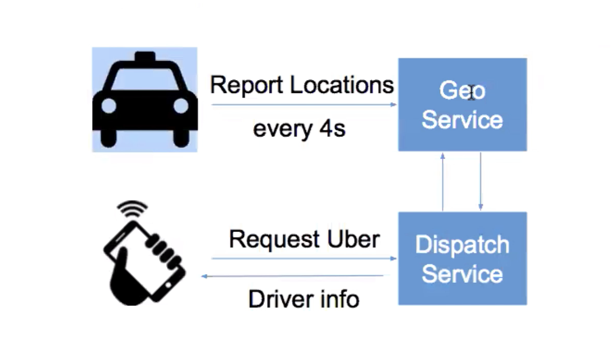
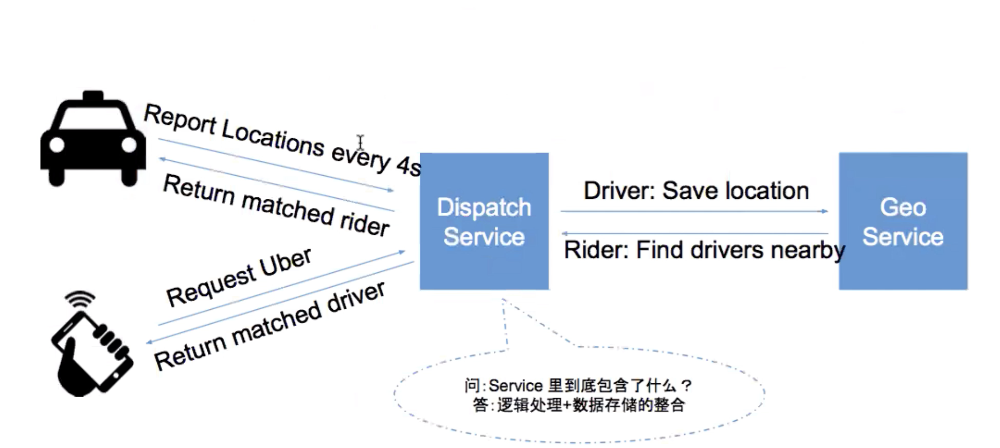
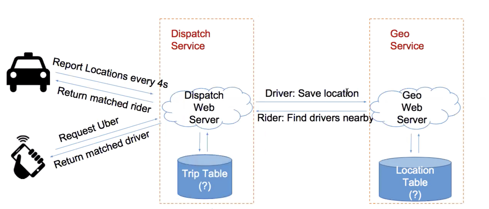
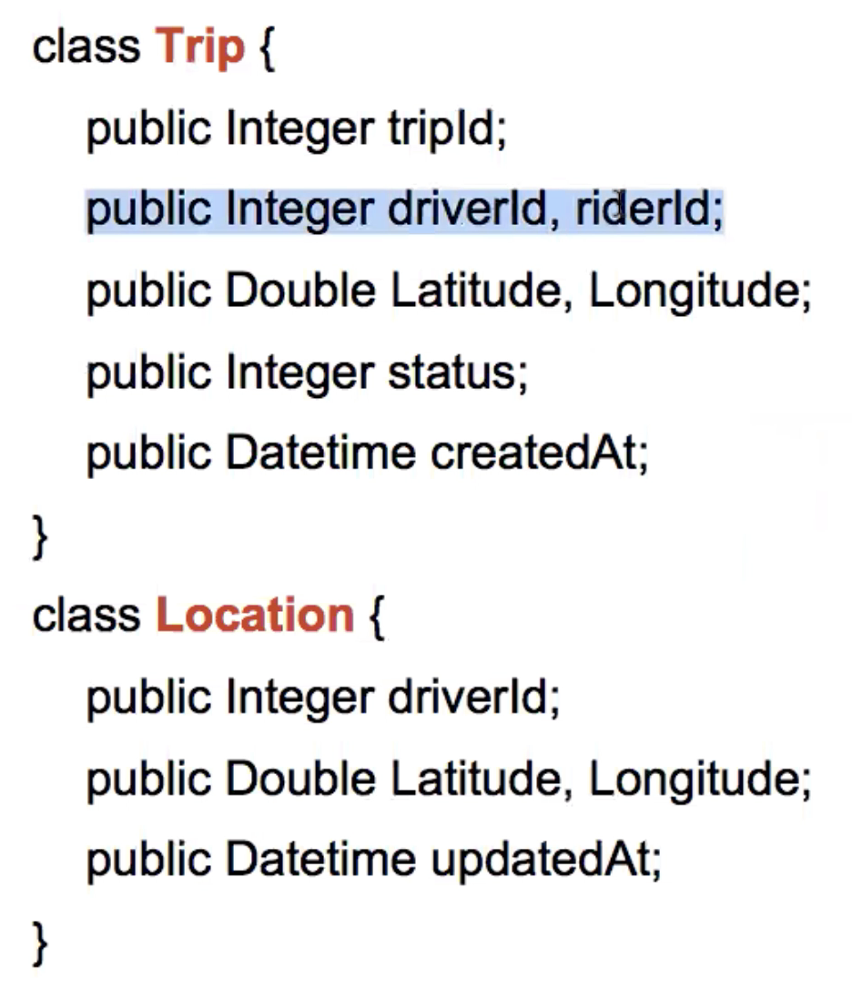
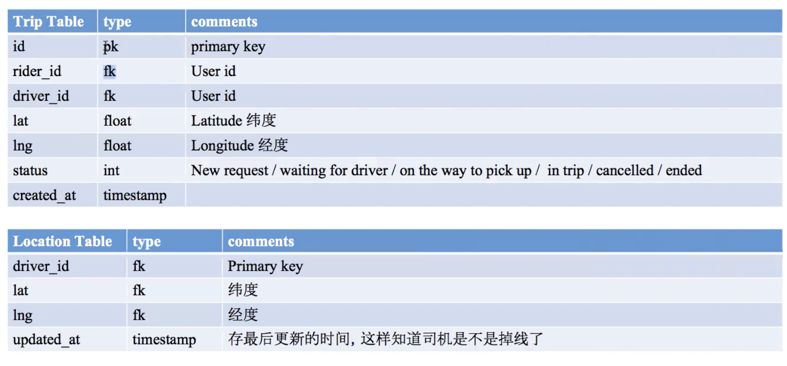
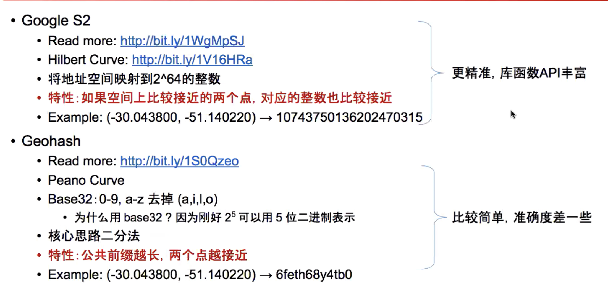

# Location-Based Service

## How to design Uber

or /Facebook nearby/Yelp/...\(any location based apps\)

### Scenario

#### Stage 1

* Drivers report locations
* passenger request Uber, match a driver with passenger

#### Stage 2

* Driver deny/accept a request
* Driver cancels a matched request
* passenger cancels a request
* Driver picks up a rider and starts a trip
* Driver drops off a rider and ends a trip

#### Stage 3\*

* Uber pool
* Uber eats

#### Level of performance the system should be performing

* Assuming 200K riders are online at the same time
  * Driver reports location every 4 seconds is a reasonable number
    * QPS = 200K / 4 = 50K
    * Peak QPS = 50K \* 3 = 150K
      * 150K writes is not a small number at all, it requires a write-bound, fast storage
  * passenger QPS can be ignored
    * Confidential considerations
    * Must be far less than drivers'
* Volumes estimation
  * If record each location info: 200K \* 86400 / 4 \* 100 bytes ~= 0.5T/day
  * If only record current location info: 200K \* 100 bytes = 20M/day

### Service

Uber mainly are doing two things:

* Geoservice
  * Record vehicle's location
* DispatchService
  * Match request between driver and passenger

#### Stage 1

passenger request can be pushed to driver or when driver reports its location, the response will bring a ride request if there's any.

#### Stage 2

The problem with above structure is it does not include how the driver receives the match request, the solution is when driver-client reports its location every 4 seconds, the response could includes a match request if there's a match

### Storage

* Trip table read more than write
* Location table write more than read

#### Schema

### How LBS stores geography information

How to find drivers within certain latitude and longitude?

select \* from locations where lat &lt; xxx and lat &gt; yyy and log &lt; zzz and log &gt; kkk

The problem with this is that it finds all drivers within a latitude range and then find all drivers within a longitude range, then union them.

