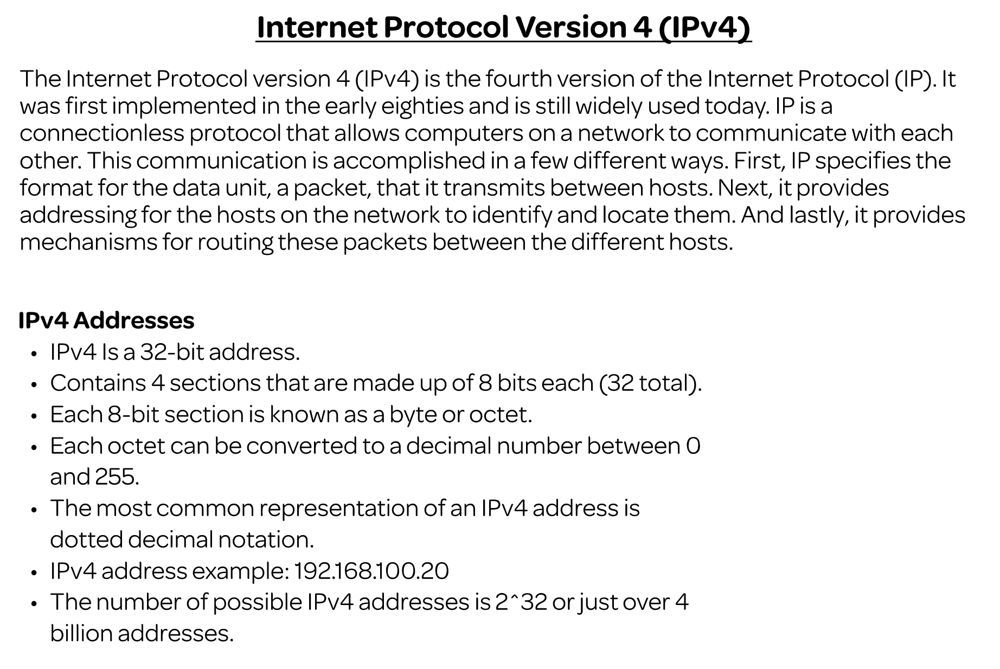
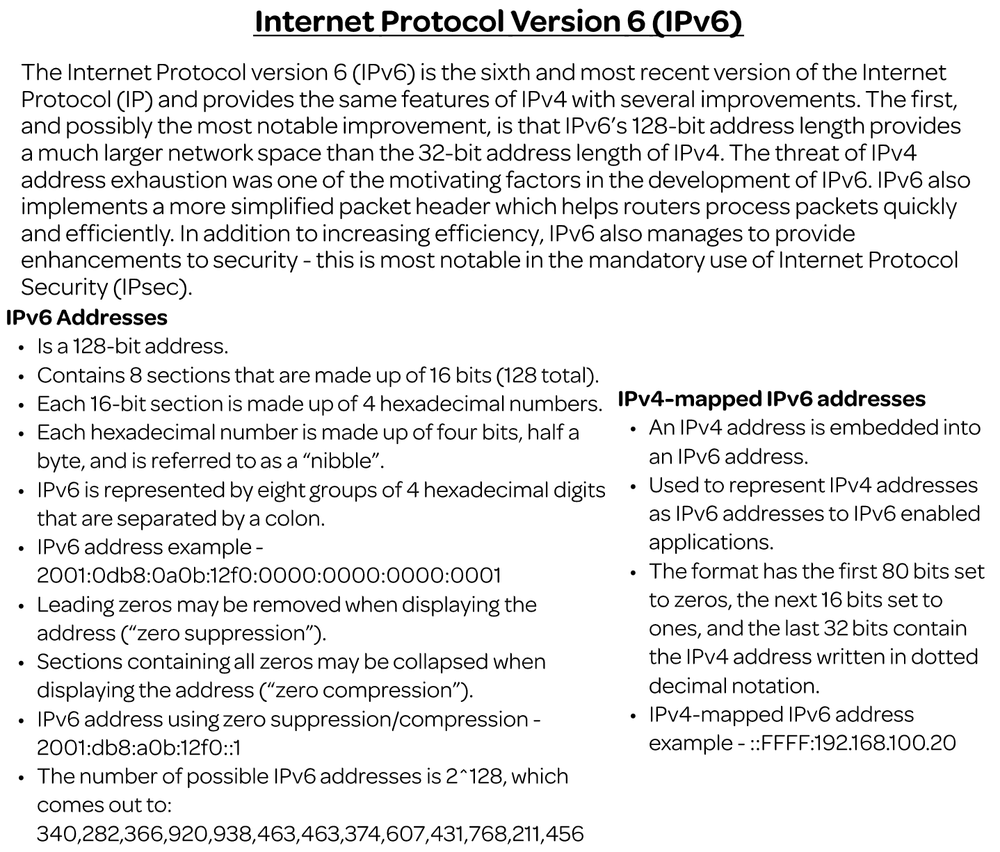
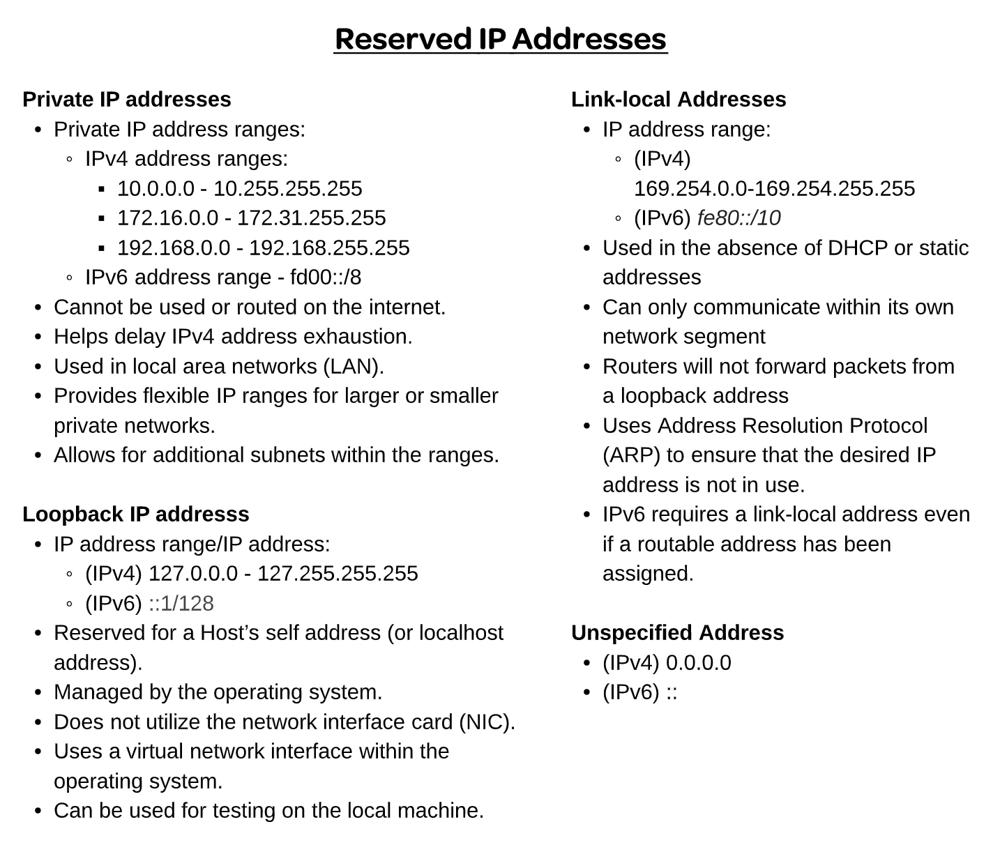
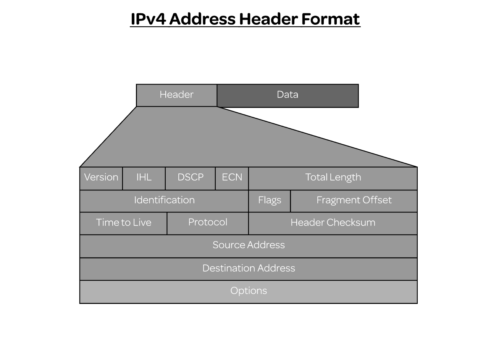
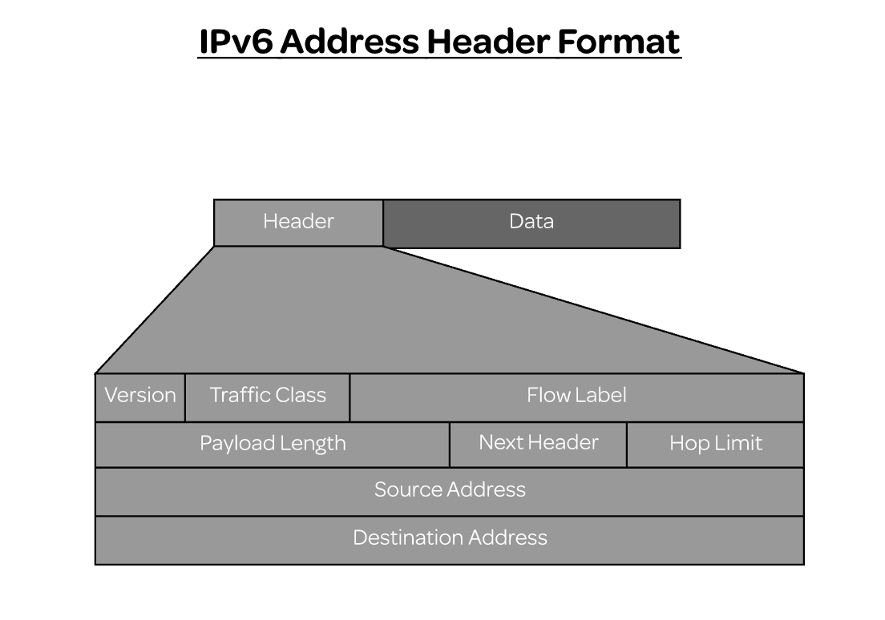
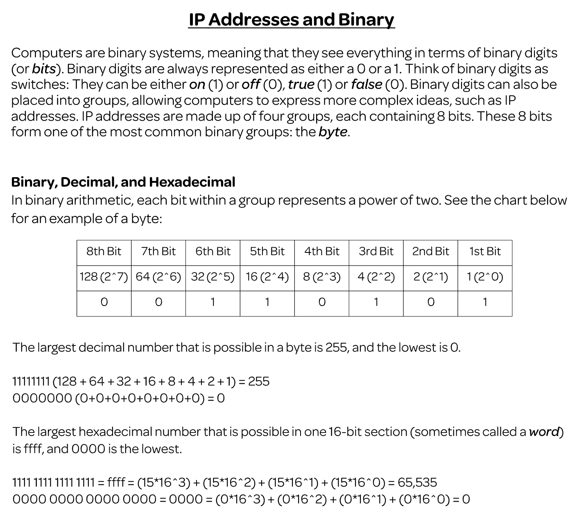
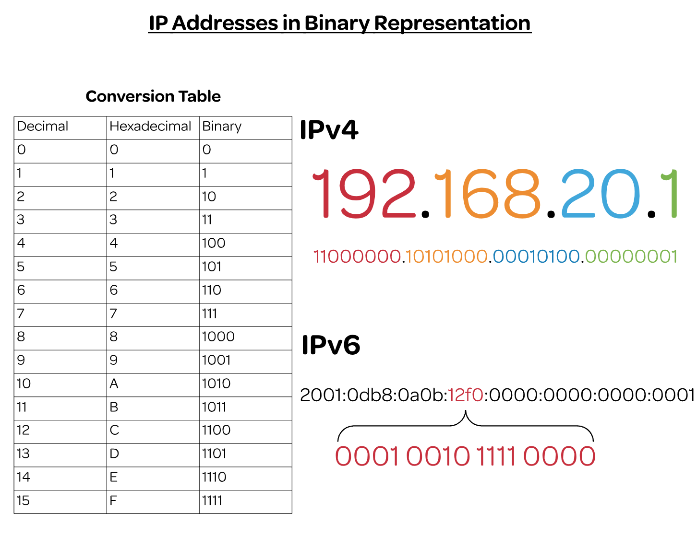
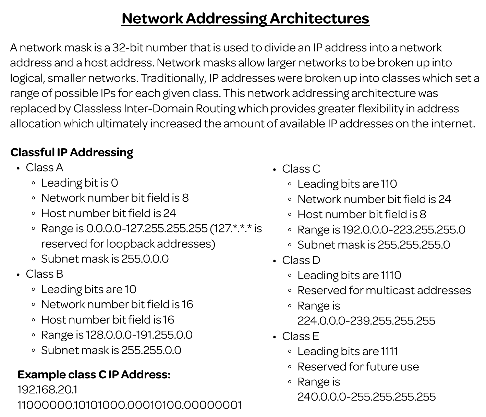
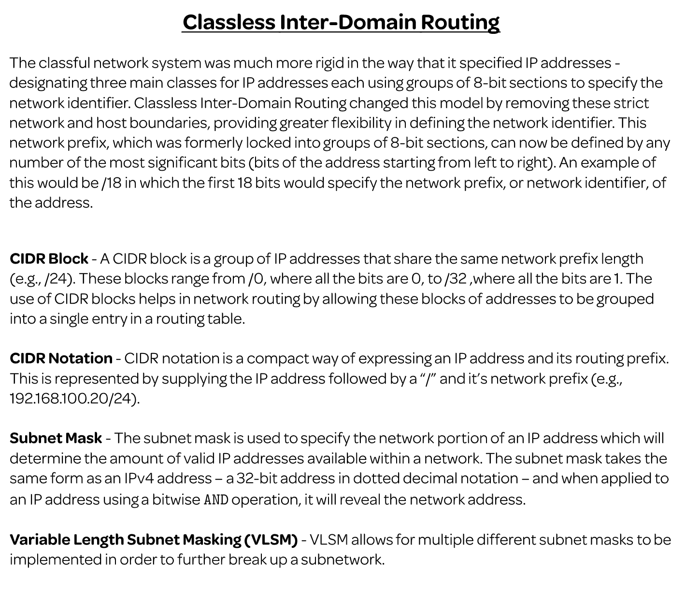

# Network Routing

## IP

### IPv4

### IPv6

### Reserved IP Address

### IPv4 Header Format

### IPv6 Header Format

### IP Addresses and Binary

### IP Address in Binary Representation

### Network Addressing Architectures

### CIDR

