# Subnetting

## Network Traffic

### Traffic methods

* Unicast
* Multicast
* Broadcast

### OSI

Open System Interconnection Model

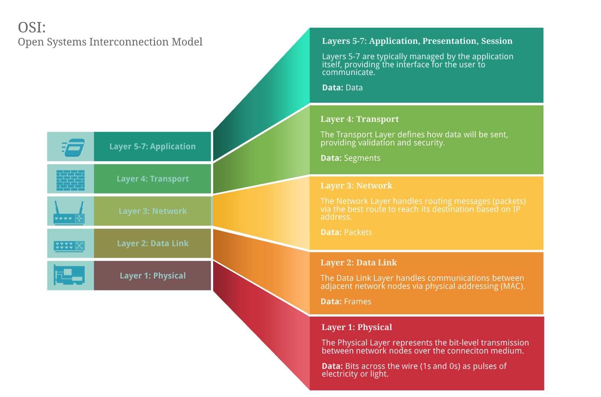

### TCP/IP

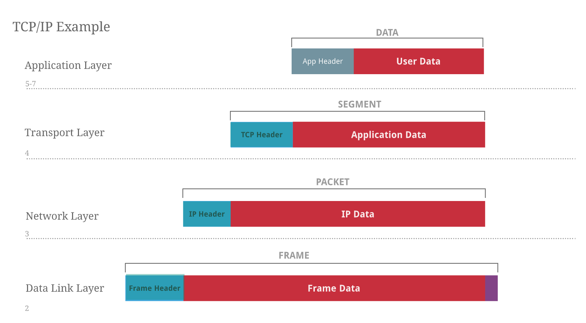

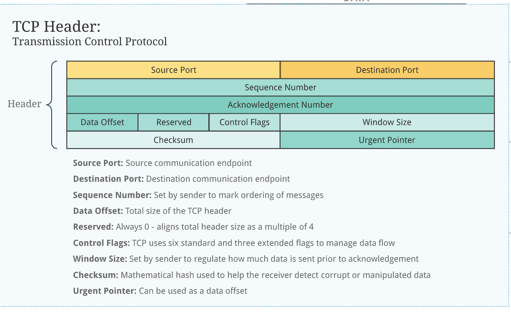

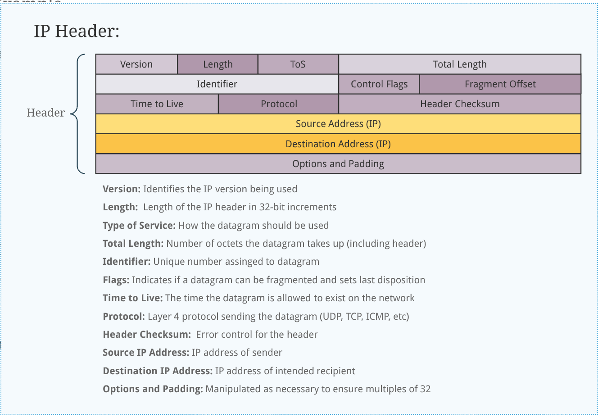

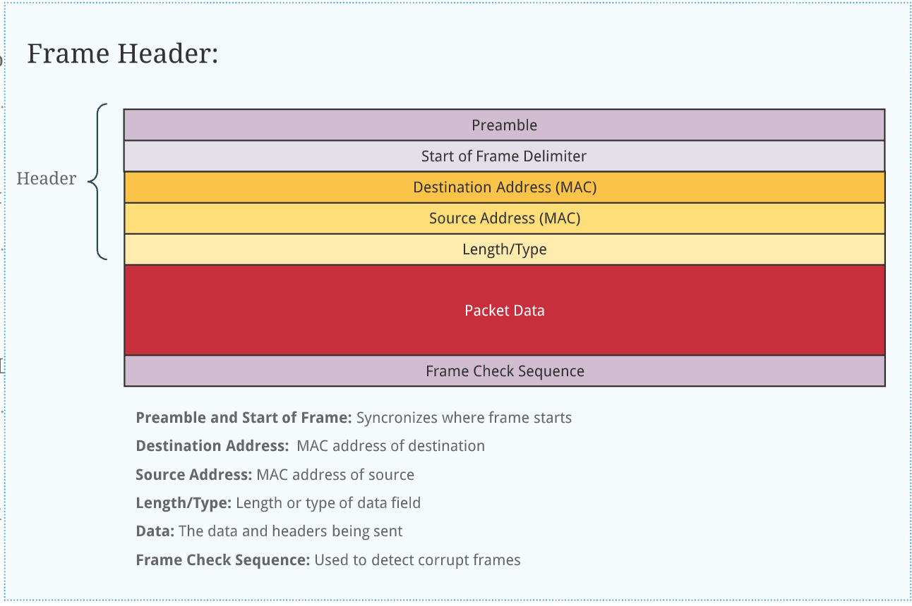

## Network Segmentation

### Why we need segmentation

In any local network like a small corporate network, there could be few things that affect network.

### Bad actor

It could compromise the network resources it has access to. Like a host in the sales department trying to access application server through local network.

### Limiting

In a single-scoped network, bandwidth competition could lead to quality of service issues for important services and hosts.

### Scaling

Needs to easily scale out.

### Benefits

* Improve network performance and speed
* Reduce network congestion
* Enhance security
* Controlled Expansion
* Maintenance and Administration

## Addressing

### IPv4

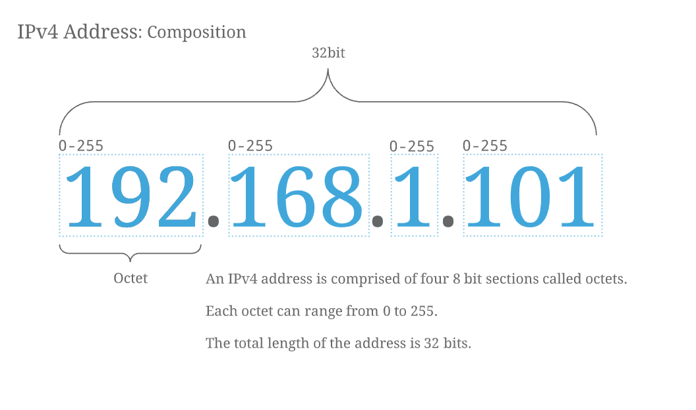

### IPv6

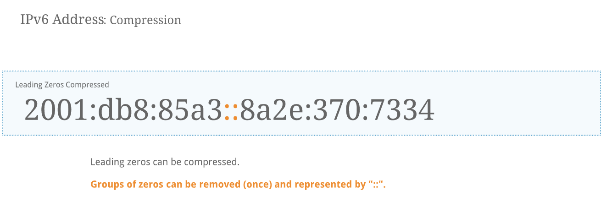

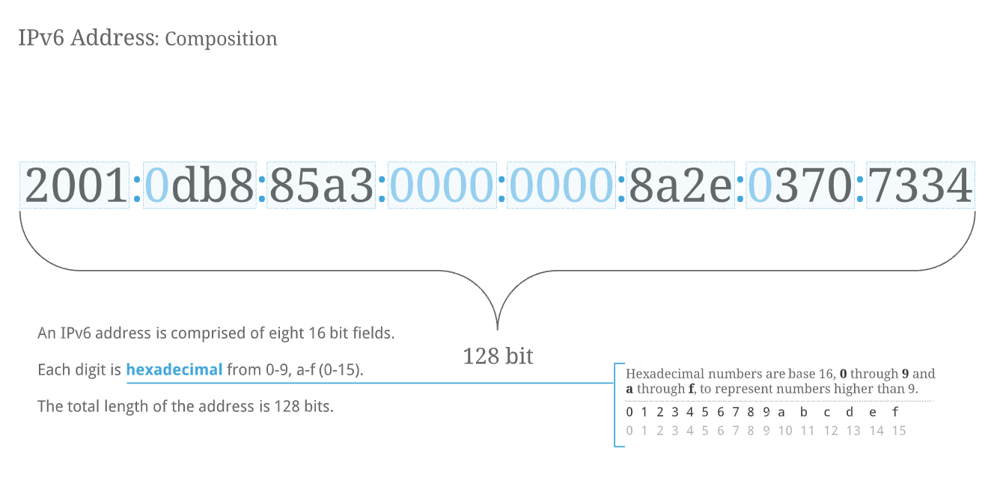

### MAC

Hardware address on NIC

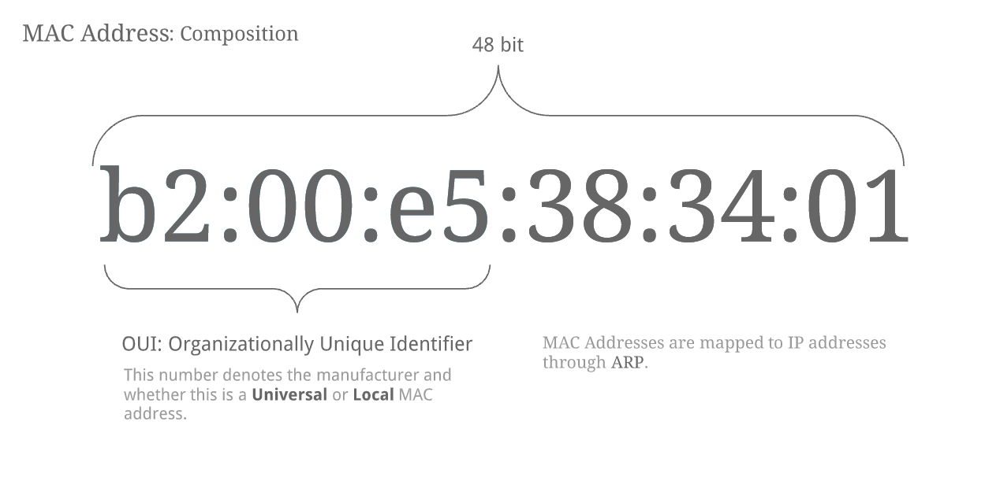

### ARP

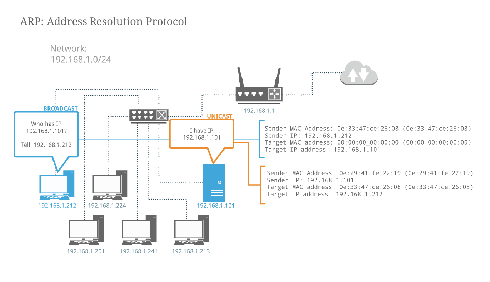

## Network Masks

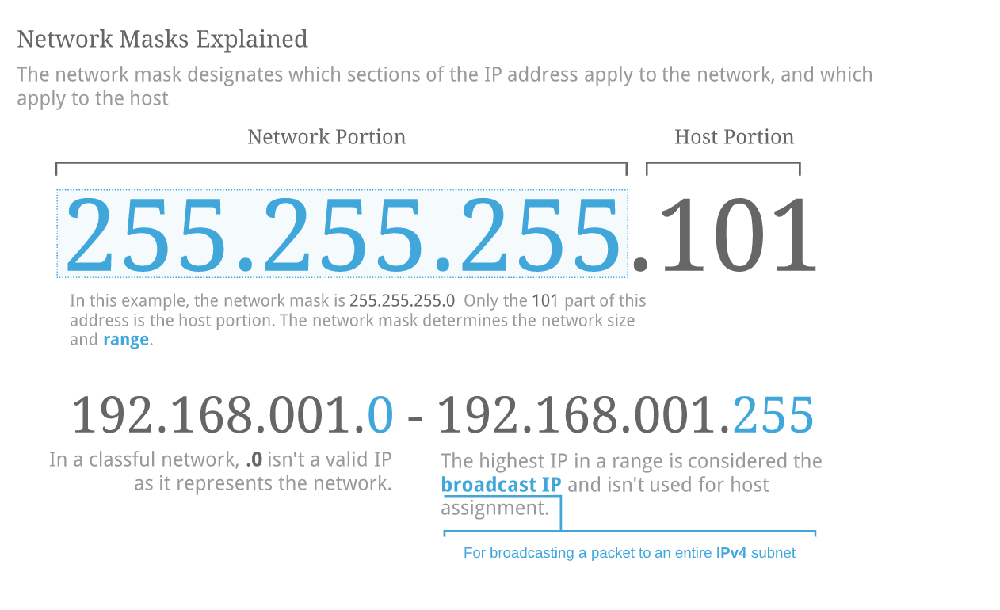

### Number of Hosts

### Range of Network Address

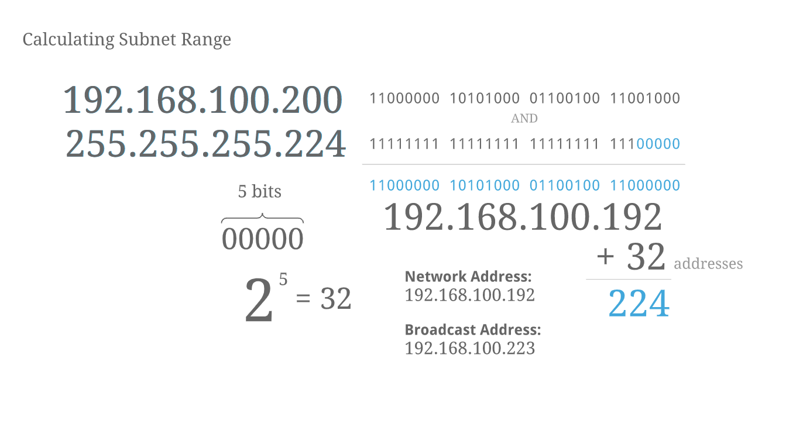

### Number of Subnets

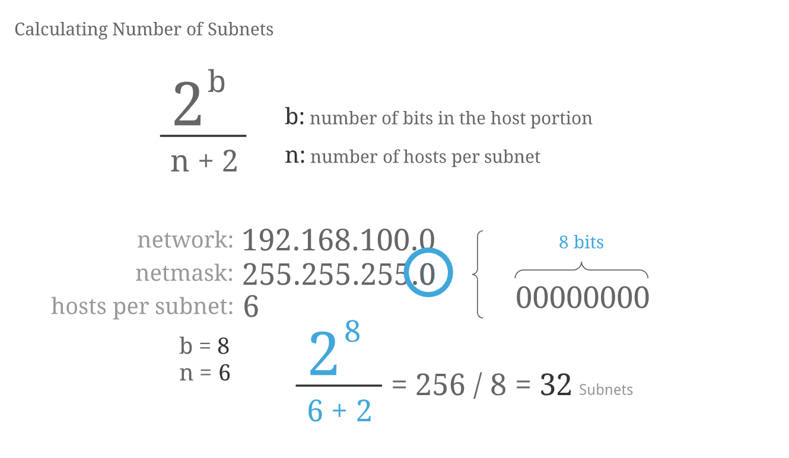

## Classful Networking

## CIDR

Classless Inter-Domain Routing

* Does not use classes at all for networking assignment or sizing
* The entire unicast range can be segmented into any sized network
* Subnet masks not limited to 255.255.255.0, 255.255.0.0 or 255.0.0.0

### Calculating Network Range

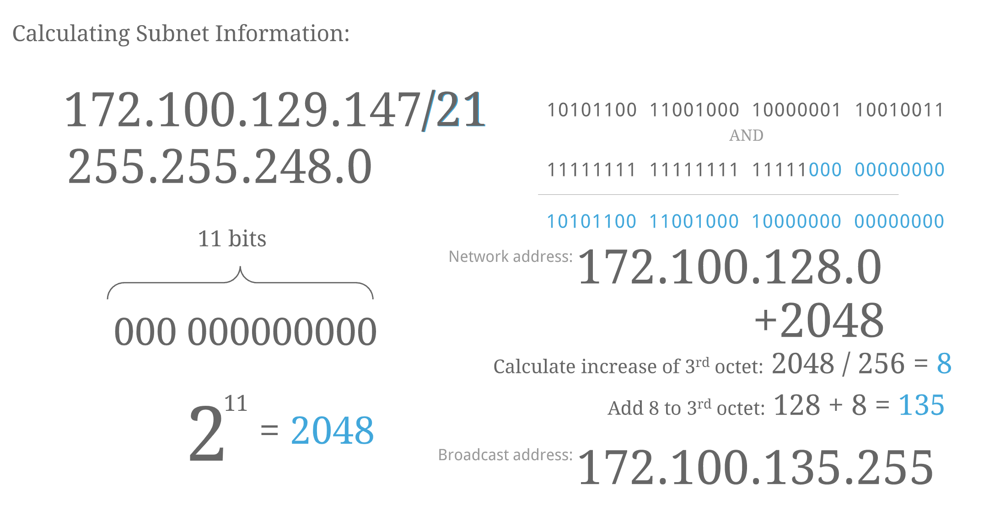

